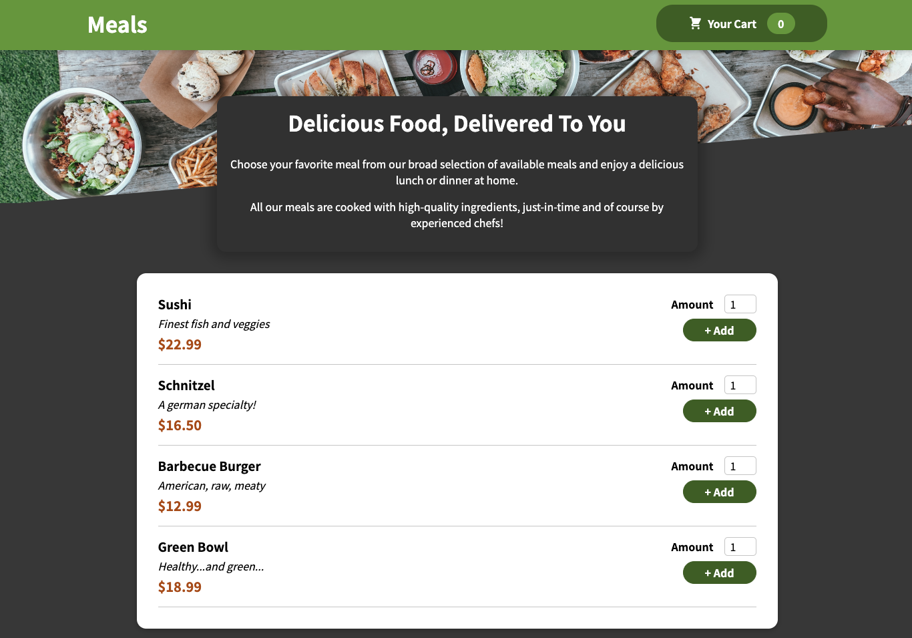
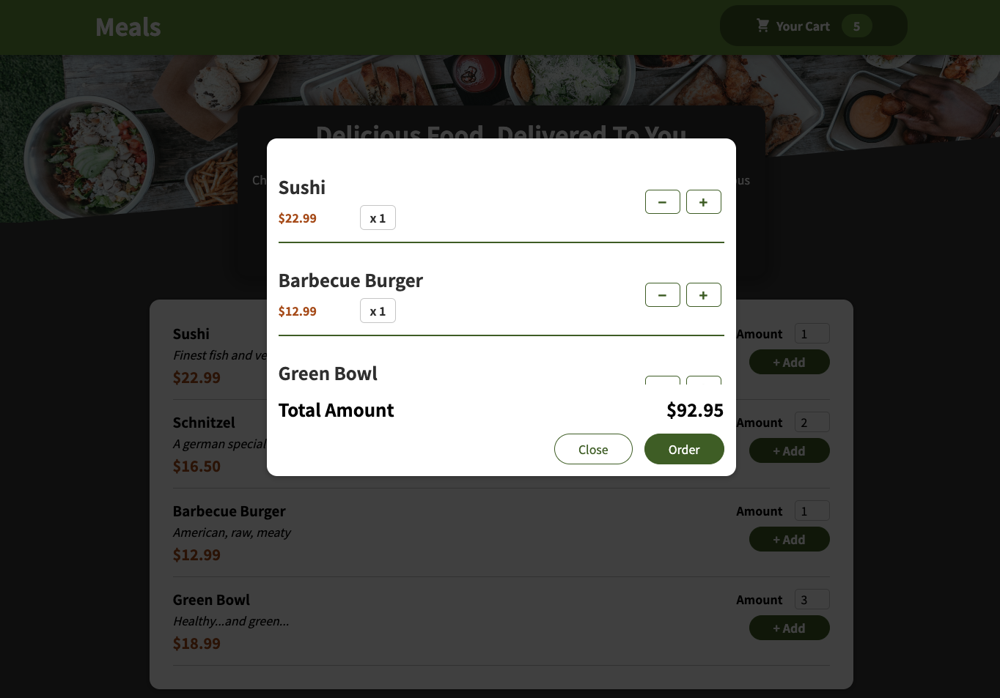

# Meals - Food Order Page

Welcome to the Meals project, a food order page built using JavaScript and React.
I used CSS modules for styling to ensure scoped and maintainable styles.
Each component's CSS is modularized and locally scoped to prevent style conflicts.

## Project Structure

The project is structured into several components:

- `Cart`: Manages the items in the user's cart and allows users to add or remove items.
- `Meals`: Displays the available food items for users to order.
- `Layout`: Defines the overall structure of the application, including header and header button.
- `UI (User Interface)`: Contains reusable UI components used throughout the application. Like Card, Input and Modal.

## Deployment

Deployed with Github Pages.

_Link:_ https://fercfmsouza.github.io/Food-Order/

## Example Image

Here's a screenshot of the application in action:

